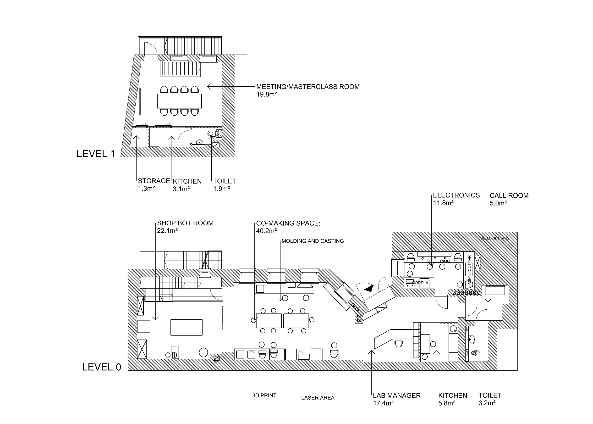

We have just established a new facility in Wrocław

**Address**:Łokietka 12c, 50-243 Wrocław, Poland

**Fig.** Fab Institute in the city center of Wrocław.

**Fig.** Entrance to the Fab Institute from Brodatego Street.

**Fig.** The current arrangement with individual offices and 10 desks to rent.

**Fig.** The current arrangement for the conference (40people) venue.

**Fig.** The target arrangement for Fab Institute (a Fab Academy node).

#**For rent!**

#Office M

- **capacity:** 4-6 people
- **area:** 26.2m2
- **features:** individual entrance, exlusive kitchen and bathroom, equipped with white board and large screen
- **price:** 2500PLN/month including everything (heating, water, electricity, internet)
- **check availability with Ania:** +48 500 134 116
##**Office XS**

- **capacity:** 1-3 people
- **area:** 11.8m2
- **features:** access to shared fully-equiped kitchen, bathroom and call room (a dedicated room for comaking space and XS office users to run virtual meetings in private)
- **price:** 1500PLN/month including everything (heating, water, electricity, internet)
- **check availability with Ania:** +48 500 134 116
##**Desks in comaking space**

- **capacity:** 1 person
- **area:** an individual workspace in the large co-making area including large comfortable desk 140x70cm, chair and a desk cupboard
- **features:** access to shared fully-equiped kitchen, bathroom and call room (a dedicated room for comaking space and XS office users to run virtual meetings in private)
- **price:** 500PLN/month including everything (heating, water, electricity, internet)
- **check availability with Ania:** +48 500 134 116
