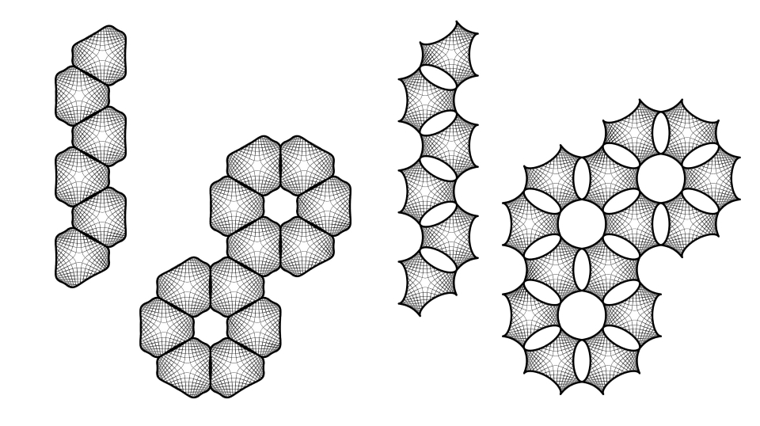

# Final Project

My participation in Fab Academy 2023 is sponsored by Eurepean Union  (EU funding: 101033646).
One of the goals of my OPTIshell research project is to build a prototype of the timber solar canopy structure covered with the PV material.
More about the project [optishell.io](https://optishell.io/).
During Fab Academy I would like to build a stiffness-scaled model in 1:10 or 1:18 scale. 

**Fig.1.** Conceptual model.

**Fig.2.** Final project dilema.

## Weekly notes

## **Week 01**
Base idea:a 1:10 model from laser cut thin plywood, filling the spaces with the plate panels, 3D print the foundation structures.

IO additions and difficulty level (+++):
:	add PV elements on some of the plates, connect to battery and show the level of the battery (++);create a sensor at the bottom to remotely display if the place is occupied (+);create a simple machine to erect the structure e.g. an extendable tube in the middle(+++);add sensor of the wind to inform if the wind is too strong (alternatively dismount) (+++)

### Spiral Development

**Spiral 01 Objectives:**

- [ ] 1) static 1:10 stiffness-scaled model from laser cut thin plywood - single layer laths,

- [ ] 2) filling the spaces with the plate panels

- [ ] 3) 3D printed the foundation structures

- [ ] 4) IO - a sensor showing if the space is occupied (remotely)?

**Spiral 02: Objectives:**

- [ ] 1) a static 1:10 stiffness-scaled model from laser cut thin plywood - double layer laths,

- [ ] 2) filling the spaces with the plate panels + cover with small solar cells

- [ ] 3) 3D printed the foundation structures + installed batteries

- [ ] 4) IO - a sensor showing if the space is occupied (remotely)? + level of battery display

**Spiral 03: Objectives:**

- [ ] 1) a KINETIC 1:10 stiffnes-scaled model from laser cut thin plywood 

- [ ] 2) filling the spaces with the plate panels + cover with small solar cells

- [ ] 3) 3D printed the foundation structures + installed batteries

- [ ] 4) IO - a sensor showing if the space is occupied (remotely)? + level of battery display

- [ ] 5) a small machine for self-assembly

## **Week 02**

I reviewed some research papers about asymptotic gridshells.

1. Asymptotic Gridshells - applications and analysis. [paper](https://www.behance.net/gallery/86066625/MT-Asymptotic-Gridshells-applications-and-analysis)

2. DESIGN AND CONSTRUCTION OF THE ASYMPTOTIC PAVILION [paper](https://mediatum.ub.tum.de/doc/1468899/1468899.pdf)

3. The design, fabrication and assembly of an asymptotic timber gridshell. [paper](https://www.researchgate.net/publication/336367443_The_design_fabrication_and_assembly_of_an_asymptotic_timber_gridshell)

4. Morphology of Kinetic Asymptotic Grids. [paper](https://eikeschling.com/2022/09/23/morphology-of-kinetic-asymptotic-grids/)

5. Designing Asymptotic Geodesic Hybrid Gridshells. [paper](https://eikeschling.com/2022/09/05/designing-asymptotic-geodesic-hybrid-gridshells/)

 “if surface is completely minimal, the asymptotics in the gridshell will coincide perfectly perpendicular, which result in torsion-free nodes and straight strips” (Eike Schling, 2018)

### Design goal

A small scale roof structure/ a canopy, which can be built without a building permit, providing a sheltered space from the rain and the sun.

- [ ] 1) timber gridshell from flat straight planks 

- [ ] 2) covered with watertight matter

- [ ] 3) assembly from flat

- [ ] 4) approx. coverage area 35m2

### Geometric Requirements

**Table 1.** Geometric requirements for asymtotic gridshell.

### Proposals V1 V2

Taking into consideration the geometric requirements, 2 subsurfaces were cut out of the minimal surface Enneper 3. The asymptotic curves were found with the custom-scripted component for Grasshopper.

**Fig 1.** Geometric comparison of the V1 and V2 proposals.

Two proposal V1 and V2 can be built as a stand-alone structures. However for the modular assembly is important for the possibilities to cover large spaces. Some modular arrangements are presented below.

**Fig 2.** Modular arrangements - top view.

**Fig 3.** Modular arrangements - isometry.

