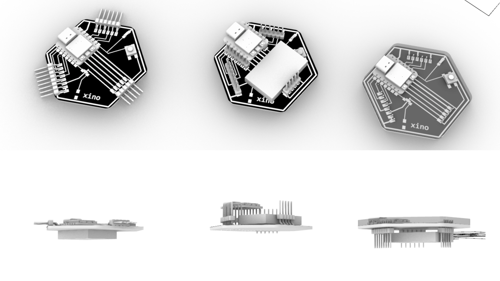

# Xino-Remote

## Idea for Xino Remote
A PCB board based on


## XIAO ESP32-C3 & XIAO BLE nRF52840 Sense


**Fig.** XIAO ESP32-C3 & XIAO nRF52840 (Sense) overview.


**Fig.** XIAO ESP32-C3 &  XIAO nRF52840 (Sense)  - pin layouts.

### Specifications

|Parametric    |     XIAO ESP32C3       |  XIAO BLE nRF52840 Sense |
| ----------- | ------------------- |------------------- |
|  **CPU**   |  ESP32-C3, 32­bit RISC­-V single­core processor that operates at up to 160 MHz |Nordic nRF52840, ARM® Cortex®-M4 32-bit processor with FPU, 64 MHz|
| **Wi­Fi**   |Complies with IEEE 802.11b/g/n protocol and supports Station mode, SoftAP mode, SoftAP + Station mode, and promiscuous mode | - |
| **Wireless capabilities** | LE subsystem: Supports features of Bluetooth 5 and Bluetooth mesh |Bluetooth 5.0 with onboard antenna|
| **Power** | Deep sleep power consumption is about 43μA |Standby power consumption is less than 5μA|
| **Battery charging** | chip: Supports lithium battery charge and discharge management [Battery-AS1337A/B EB: 3.3V @ 200mA, 0.65 ~ 4.5V in] The battery pad of XIAO_ESP32C3 is not connected to any port, so the battery voltage cannot be read and there is a risk of over-discharging the battery [can be done manualy](https://forum.seeedstudio.com/t/battery-voltage-monitor-and-ad-conversion-for-xiao-esp32c/267535))| chip: Supports lithium battery charge and discharge management [Battery-AS1337A/B EB: 3.3V @ 200mA, 0.65 ~ 4.5V in] battery port connected to the pad and can read the voltage|
|interfaces| 1xI2C, 1xSPI, 1xI2S, 2xUART, 11xGPIO(PWM), 4xADC, 1xJTAG bonding pad interface | 1xUART, 1xI2C, 1xSPI, 1xNFC, 1xSWD, 11xGPIO(PWM), 6xADC|
|in-built sensors| -| PDM microphone,  6-axis LSM6DS3TR-C IMU|
|  **Arduino** | [XIAO ESP32-C3 Arduino Getting started](https://wiki.seeedstudio.com/XIAO_ESP32C3_Getting_Started) |[XIAO nRF52840 Arduino- Getting started](https://wiki.seeedstudio.com/XIAO_BLE/), [XIAO nRF52840 Arduino - Sensors](https://how2electronics.com/using-imu-microphone-on-xiao-ble-nrf52840-sense/), [XIAO nRF52840 Arduino - Send/Receive](https://how2electronics.com/send-receive-data-to-mobile-app-with-xiao-ble-nrf52840-sense/)
| **MicroPython** | [XIAO ESP32-C3 Micropython - GITHUB](https://github.com/IcingTomato/micropython_xiao_esp32c3) [ Micropython GITHUB](https://github.com/micropython/micropython); [[XIAO ESP32-C3 Micropython - getting started](https://docs.micropython.org/en/latest/esp32/tutorial/intro.html#esp32-intro)[XIAO ESP32-C3 Micropython - Sensors & Send/Receive](https://docs.micropython.org/en/latest/esp32/quickref.html)| [XIAO nRF52840 MicroPython - GITHUB](https://github.com/micropython/micropython/tree/master/ports/nrf/boards/seeed_xiao_nrf52)|
| **KiCAD model** | [ZIP](https://files.seeedstudio.com/wiki/XIAO_WiFi/Resources/Seeeduino-XIAO-ESP32C3-KiCAD-Library.zip)|[ZIP]()|
| **Model 3D**| [STEP](https://grabcad.com/library/seeed-studio-xiao-esp32-c3-1)| [STEP] |


1. download the most recent MicroPython firmware .bin file to load onto your ESP32 device. You can download it from the MicroPython downloads page


For best results it is recommended to first erase the entire flash of your device before putting on new MicroPython firmware.

Currently we only support esptool.py to copy across the firmware. You can find this tool here: https://github.com/espressif/esptool/, or install it using pip:

```
pip install esptool
```
Using esptool.py you can erase the flash with the command:
```
esptool.py --port /dev/ttyUSB0 erase_flash
```
deploy the new firmware using:
```
esptool.py --chip esp32 --port /dev/ttyUSB0 write_flash -z 0x1000 esp32-20180511-v1.9.4.bin
```


1. https://micropython.org/download/seeed_xiao_nrf52/

### Software & Reference Project Links


### Arduino Set up
https://wiki.seeedstudio.com/XIAO_BLE/

Step 3. Add Seeed Studio XIAO nRF52840 (Sense) board package to your Arduino IDE

Navigate to File > Preferences, and fill "Additional Boards Manager URLs" with the url below: https://files.seeedstudio.com/arduino/package_seeeduino_boards_index.json

## Links:

- [link how to use in-built sensors](https://how2electronics.com/using-imu-microphone-on-xiao-ble-nrf52840-sense/)

- [producent website](https://www.seeedstudio.com/Seeed-XIAO-BLE-Sense-nRF52840-p-5253.html)

- [data sheet](https://files.seeedstudio.com/wiki/XIAO-BLE/BQ25101.pdf)

- [micro-python for seed xiao nrf52](https://github.com/micropython/micropython/tree/master/ports/nrf/boards/seeed_xiao_nrf52)

- [Getting Started with Seeed Studio XIAO nRF52840 (Sense)](https://wiki.seeedstudio.com/XIAO_BLE)

- [pet tracher](https://www.pcbway.com/project/shareproject/Pet_Activity_Tracker_using_XIAO_BLE_Sense_Edge_Impulse_786e857b.html)

**Attention:All the I/O pins are 3.3V, please do not input more than 3.3V, otherwise, the CPU may be damaged.**

## XINO remote - Kicad

[kicad resources](https://wiki.seeedstudio.com/Seeeduino-XIAO/#resourses)

**Import the Symbol library to Kicad**
- Open your Kicad Project
- Go to Preference —> Manage Symbol Libraries

- Click the “+” button below
- Configure the Nick Name and the Library Path (choosing the Library you download from the wiki, called: …\Seeeduino XIAO KICAD\Seeeduino XIAO.lib)
- Then hit OK

Import the Footprint library to Kicad
Go to Preference —> Manage Footprint Libraries


## XINO remote - ideas with Battery


**Fig.** Conceptual Xino-remote.


**Fig.** Conceptual 3 versions Xino-remote.

## battery
The red one is positive (+), the black one is negative (-). Never connect the red cable to the negative battery terminal or a vehicle with a dead battery.

## Setting Up Arduino IDE

https://how2electronics.com/getting-started-with-seeed-xiao-ble-nrf52840-sense/

1. Connect the XIAO BLE (Sense) to your computer via a USB Type-C cable.

2. Download and Install the latest version of Arduino IDE according to your operating system. Then launch the Arduino application.

3. There is no pre-installed package for NRF52840 Board. So we need to first install the board on Arduino IDE. To do that Navigate to File > Preferences, and fill “Additional Boards Manager URLs” with the URL below:
https://files.seeedstudio.com/arduino/package_seeeduino_boards_index.json

4. Navigate to Tools > Board > Boards Manager, type the keyword “seeed nrf52” in the search box, select the latest version of Seeed nRF52 Boards, and install it.


Sending BLE data to mobile:
https://github.com/just4give/ei-blue/blob/master/firmware/xiao_ble_sense/imu_capture.ino
## Sensors

Thermal Camera: https://www.seeedstudio.com/Grove-Thermal-Imaging-Camera-IR-Array-MLX90640-110-degree-p-4334.html

Project :https://www.hackster.io/mithun-das/pet-activity-tracker-using-xiao-ble-sense-edge-impulse-858d73
